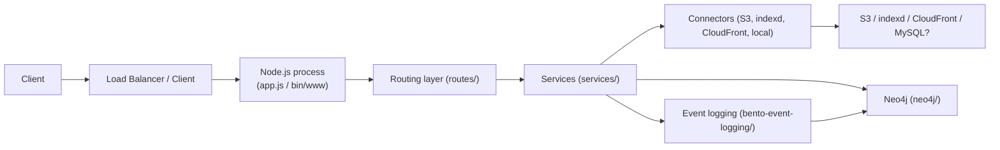

# System overview

## Purpose

Bootstrap system overview for quick orientation: observed entrypoints, major components, and high-level runtime topology.

## Entrypoints (Observed)
- `app.js` — primary application module (observed in repository root).
- `bin/www` — server launcher (typical Express-style start script).
- `package.json` — scripts and dependencies (observed).

## Major components (high-level, see components doc)
- HTTP server / Express app (`app.js`, `bin/www`, `routes/`)
- Routing layer (`routes/`)
- Services (`services/`) — business logic and integrations
- Connectors (`connectors/`) — external integrations (S3, indexd, CloudFront, local, dummy)
- Data models (`model/` and `bento-event-logging/model/`)
- Neo4j integration (`neo4j/neo4j-operations.js` and `bento-event-logging/neo4j/neo4j-operations.js`)
- Utilities and auth (`utils/`, `auth.js`, `services/user-auth.js`)

## Runtime topology (Observed + Inferred)

Notes:
- Items marked above are directly observed from repository files and paths. Diagrams are conservative and avoid assuming background workers or extra processes that are not present in code.

## Where to look next
- See [architecture/components.md](architecture/components.md) for component details.
- See [architecture/runtime-flows.md](architecture/runtime-flows.md) for flow categories and diagrams.
